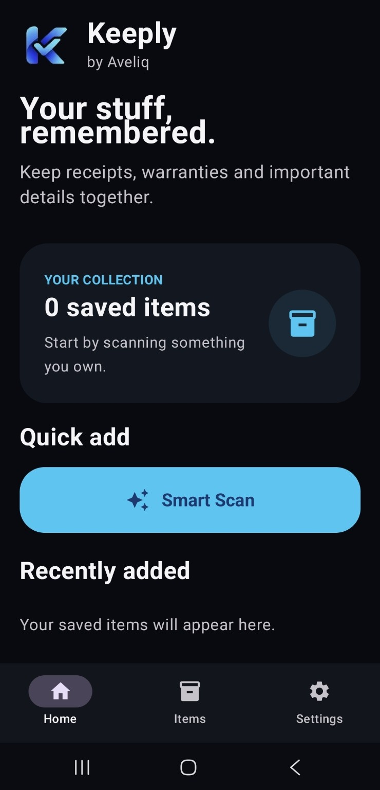
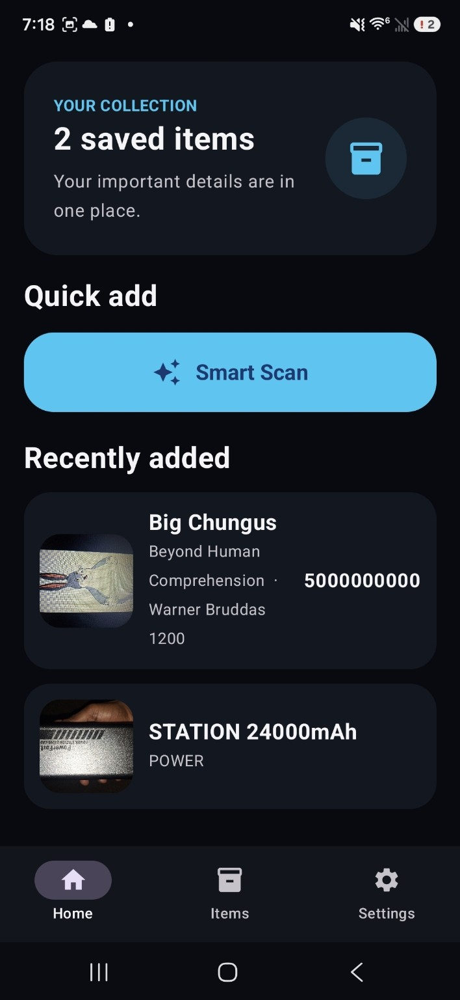
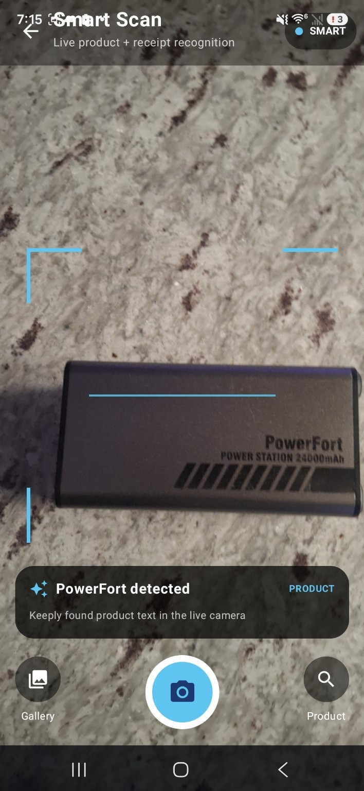

<div align="center">

# Keeply

### Your stuff, remembered.

**by Aveliq — Independent Technology**

A simple Android app for keeping receipts, purchase details, warranties, notes, and important information about the things you own — all in one place.

[**Screenshots**](#screenshots) • [**Features**](#features) • [**Installation**](#installation) • [**Build from source**](#build-from-source) • [**Contributing**](#contributing) • [**Project status**](#project-status)

</div>

---

> **Keeply is an independent, open-source Android project built by TheDeveloperCal under Aveliq.**
>
> The project is in active development. Expect changes, unfinished features, and occasional bugs while the app evolves.

## Screenshots

### Home

Keeply gives you a simple home screen for your collection and quick access to Smart Scan.

<p align="center">
  
</p>

### Your collection

Saved items appear directly on the home screen so the information you care about stays easy to find.

<p align="center">
  
</p>

### Smart Scan

Smart Scan uses the live camera to read product text and barcodes and identify recognizable information as you scan.

<p align="center">
  
</p>

## Description

Keeply is built around a simple idea: **the things you own have information worth remembering.**

Instead of searching through photo galleries, emails, receipts, or paper documents, Keeply gives you one place to save useful details about your stuff.

The project is designed with a local-first mindset and focuses on a clean Android experience without requiring a proprietary account just to keep your personal collection.

## Features

- **Smart Scan** — scan products with the live camera.
- **Text recognition** — read useful product text directly from the camera.
- **Barcode scanning** — detect supported product barcodes.
- **Item collection** — keep saved items together in one place.
- **Item photos** — keep a visual record of the things you own.
- **Receipts and purchase details** — keep important ownership information together.
- **Warranty and return information** — designed to help you remember important dates.
- **Search and organization** — intended to make a growing collection easier to manage.
- **Dark interface** — designed for a comfortable modern Android experience.
- **Offline-first direction** — personal data is intended to remain useful without depending on a cloud account.

## Technology

Keeply is currently built with:

- **Android**
- **Kotlin**
- **Jetpack Compose**
- **CameraX**
- **Google ML Kit Text Recognition**
- **Google ML Kit Barcode Scanning**
- **Gradle**

The live Smart Scan pipeline intentionally focuses on OCR and barcode recognition for stability on supported Android devices.

## Installation

Keeply is currently at **v0.1.0** and is being developed as an early public/beta release.

### Build an APK yourself

Clone the repository:

```bash
git clone git@github.com:TheDeveloperCal/Keeply.git
cd Keeply
```

Then build with the included Linux build script:

```bash
chmod +x BUILD_LINUX.sh
./BUILD_LINUX.sh
```

The debug APK will be generated at:

```text
app/build/outputs/apk/debug/app-debug.apk
```

You can install it on a connected Android device with:

```bash
adb install -r app/build/outputs/apk/debug/app-debug.apk
```

> **Build environment:** the project currently targets the development toolchain documented in the repository. See the Gradle configuration and `BUILD_LINUX.sh` for the expected versions.

## Build from source

Keeply is intentionally kept approachable for independent development.

Typical workflow:

```bash
git clone git@github.com:TheDeveloperCal/Keeply.git
cd Keeply
./BUILD_LINUX.sh
```

For development, you can open the project in **Android Studio** and run it on an Android device or emulator.

## Development

The project follows a simple open-source workflow:

```text
Change code
    ↓
Build
    ↓
Test on Android device
    ↓
Commit
    ↓
Push to GitHub
```

Bug reports, ideas, improvements, documentation, and code contributions are welcome as the project grows.

## Contributing

Keeply is an independent project and contributions are welcome.

If you want to help:

1. Fork the repository.
2. Create a branch for your change.
3. Make and test your changes.
4. Open a pull request with a clear description of what changed and why.

For larger changes, opening an issue first is recommended so the direction can be discussed before significant work begins.


## Release

**Keeply v0.1.0** is the first public development release. The APK is intended to be distributed through GitHub Releases while the project remains in early development.

## Visual polish

This release includes a crisp vector-derived Keeply launcher mark and a responsive Android launch theme designed to adapt across screen densities.

## Project status

**v0.1.0 — Early development / beta.**

Keeply is already a working Android application, but it is still evolving. Some planned features are not implemented yet, and the interface and internal architecture may change.

Current priorities include:

- Improving Smart Scan accuracy and stability.
- Better item editing and organization.
- Stronger receipt handling.
- Better search and filtering.
- Warranty and return tracking.
- More reliable product identification.
- Broader device testing.
- Release builds and alternative distribution options.

## Privacy and independence

Keeply is being developed with an emphasis on user control and independent software.

The long-term goal is to make useful features available without requiring users to depend on a single app store, cloud provider, or proprietary ecosystem.

As the project grows, privacy and data ownership will remain important design considerations.

## About Aveliq

**Aveliq** is the independent technology project behind Keeply.

> **Better tools. Bigger plans.**

Keeply is developed by **TheDeveloperCal** as part of an independent Android and Linux-focused software journey.

## License

A formal open-source license will be added to this repository before the project is presented as a fully licensed open-source release.

Until then, please treat the repository as source-available development code and do not redistribute modified or compiled versions as if they were officially released by Aveliq.

## Links

- **Source:** https://github.com/TheDeveloperCal/Keeply
- **Developer:** https://github.com/TheDeveloperCal

---

<div align="center">

**Keeply — Your stuff, remembered.**

Built independently by **TheDeveloperCal / Aveliq**.

</div>
